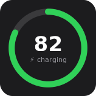
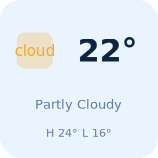

# Facet

A next-generation custom widget builder for iOS — Widgy-level depth with a
design-tool editor instead of a menu maze. See [docs/SPEC.md](docs/SPEC.md)
for the full product and architecture spec.

**One document, every surface.** A widget is a portable `.facet` file: a
layer tree + design tokens + data bindings. The same document renders on the
Home Screen, Lock Screen, and (eventually) StandBy and watchOS, adapted per
rendition by sparse overrides rather than rebuilt per size.

| | |
|---|---|
|  |  |
|  |  |

*Starter templates rendered by `facet-preview` on Linux — through the exact
resolver the iOS widget extension uses. (SF Symbols draw as placeholder tiles
off-device.)*

## Layout

```
Sources/
  FacetCore/       Document model (.facet format) + expression language
  FacetData/       Data sources, snapshot cache, refresh planning
  FacetRender/     Document resolver, SVG debug renderer, SwiftUI renderer
  FacetTemplates/  Built-in starter templates
  facet-preview/   CLI: render documents to SVG with sample data
App/               iOS app + widget extension (Xcode targets, via XcodeGen)
Templates/         Exported .facet files for the starter templates
Tests/             69 tests; everything above App/ runs on Linux
docs/SPEC.md       Product & architecture spec
```

### Architecture in one paragraph

Rendering is a pure function: `(document, data snapshot, environment) →
render tree`. The editor preview, the Linux SVG renderer, and the widget
extension all call the same `DocumentResolver`, so previews are always
truthful and the whole pipeline is testable without a device. The widget
extension is deliberately a dumb renderer — it reads pre-fetched snapshots
from the App Group cache and never does network or heavy work, which keeps it
fast and inside the extension memory budget. Data freshness is a first-class
concept: every source declares a cadence class, and `RefreshPlanner` schedules
fetches against iOS's real reload budget instead of pretending it isn't there.

## Building

### Packages (any platform, including Linux)

```sh
swift build
swift test
swift run facet-preview list
swift run facet-preview render "Battery Ring" --scheme dark --out battery.svg
swift run facet-preview render Templates/weather-glance.facet --rendition accessoryRectangular
swift run facet-preview export-templates Templates
```

### iOS app (macOS + Xcode 16)

The app project is defined by [`App/project.yml`](App/project.yml)
([XcodeGen](https://github.com/yonaskolb/XcodeGen)):

```sh
brew install xcodegen
cd App && xcodegen generate && open Facet.xcodeproj
```

Set your development team on both targets, then run the `Facet` scheme.
The App Group identifier (`group.com.facet.app`) in `AppGroupStore.swift` and
both `.entitlements` files must match an App Group in your developer account —
rename all three together if you change it.

What works in the scaffold today: the gallery seeded with starter templates,
live previews from cached + sample data, the canvas editor (select, drag,
inspect, undo, per-rendition and light/dark preview), saving documents to the
App Group, and a widget extension that renders the selected document across
all six widget families with a minute-resolution timeline for clocks. Battery
is real device data; weather/health/calendar serve sample payloads until
their WeatherKit/HealthKit/EventKit providers land.

## The expression language

Text layers are templates — `{ }` spans evaluate against the data snapshot:

```
{round(battery.level * 100)}%
{battery.state == 'charging' ? '⚡ charging' : 'battery'}
H {round(weather.high)}°  L {round(weather.low)}°
{time.hour12}:{pad(time.minute, 2)}
```

Deliberately not a scripting runtime: no loops, no I/O, no state — arithmetic,
comparisons, ternaries, string ops, and a curated function library (`round`,
`format`, `percent`, `clamp`, `pad`, `dateFormat`, `cToF`, `has`, …). Errors
carry positions for inline editor reporting, and a broken binding degrades
that one layer — never the whole widget.

## Status

Milestones from [docs/SPEC.md](docs/SPEC.md): **M1 (core model) and M2
(renderer) are done**; M3 (editor) is scaffolded in `App/`; M4 (data) has the
full pipeline with battery live and the remaining device providers stubbed;
M5 (polish/TestFlight) is open. Custom URL sources, interactive widgets,
Live Activities, AI generation, and the community gallery are v1.x per spec.
